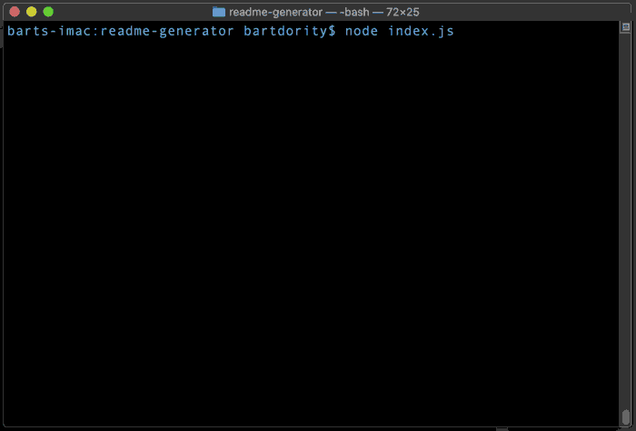

# readme generator
A command-line application that dynamically generates a goodREADME.md file from a user's input. Note: this readme file was created using this app.


## Installation
```sh
node index.js
```
## Usage
Run this file in your project folder to create the README file.

## License
[](https://creativecommons.org/licenses/by-nd/4.0)
## Badges
 [](https://shields.io/)

**on github:** <a href='github.com/b0rgBart3'>b0rgBart3</a>
[](https://github.com/remarkablemark)
Email: borgBart3@gmail.com
